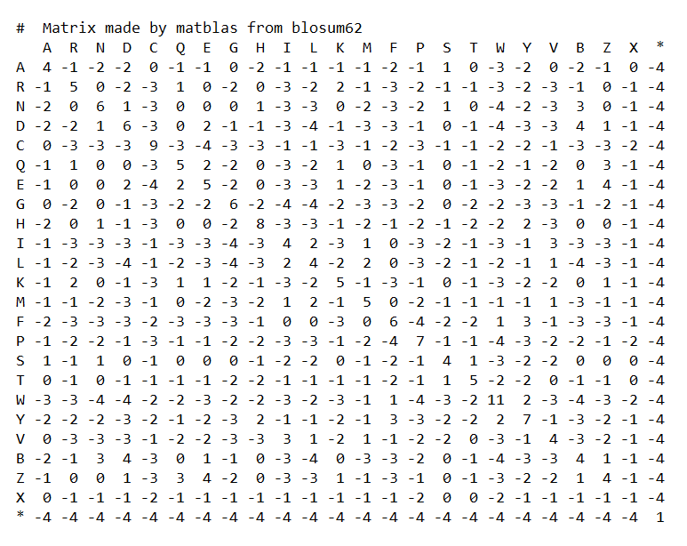
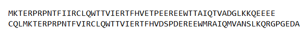

# Protein Sequence Alignment

- The subject of the program is to identify similar regions of protein sequences.
- The two protein sequences entered as input are compared according to the blosum62 matrix. Comparison matrix is created and as a result sequence alignment score is obtained.
- The Blosum (Blocks Substitution Matrix) matrix is a substitution matrix used for sequence alignment of proteins. Blosum matrices are used to score alignments between evolutionarily divergent protein sequences.
- Blosum62 Matrix :

- Input Proteins :

